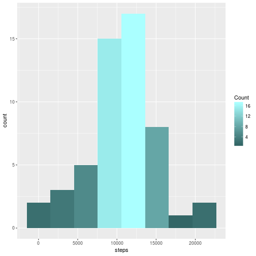
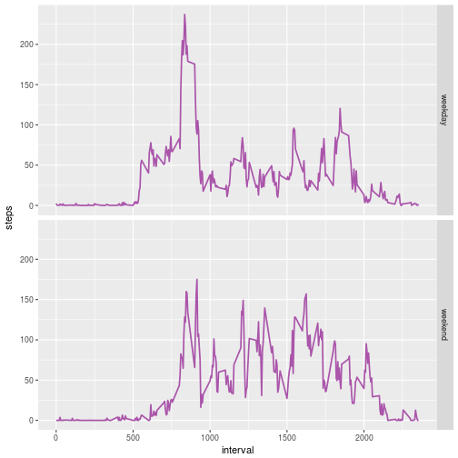

# Daily Activity Analysis
## Reproducible Research Peer Project 1
### Mike Wheelock - February 19, 2017

___

## Loading and preprocessing the data

1. Here I load my libraries and load the activities.csv file into a data table
by unzipping it, reading it out and pasting it back together for consumption
by the fread function, which then gives me a nice orderly `data.table`.


```r
setwd("~/RFiles/ReproducibleResearch/RepData_PeerAssessment1")
library("data.table")
library("ggplot2")
file <- unz("activity.zip", "activity.csv")
data <- fread(paste(readLines(file), collapse="\n"))
close(file)
```

2. Then I use the `data.table` operations to coerce the date column and create
time and day_of_week columns.


```r
data <- data[, date := as.POSIXct(date, "%Y-%m-%d")]
data <- data[, time := as.POSIXct((interval %/% 100L * 60 + (interval %% 100)) * 60, origin = date, tz = "+0:00")]
data[, day_of_week := weekdays(date)]
```

```
##        steps       date interval                time day_of_week
##     1:    NA 2012-10-01        0 2012-10-01 00:00:00      Monday
##     2:    NA 2012-10-01        5 2012-10-01 00:05:00      Monday
##     3:    NA 2012-10-01       10 2012-10-01 00:10:00      Monday
##     4:    NA 2012-10-01       15 2012-10-01 00:15:00      Monday
##     5:    NA 2012-10-01       20 2012-10-01 00:20:00      Monday
##    ---                                                          
## 17564:    NA 2012-11-30     2335 2012-11-30 23:35:00      Friday
## 17565:    NA 2012-11-30     2340 2012-11-30 23:40:00      Friday
## 17566:    NA 2012-11-30     2345 2012-11-30 23:45:00      Friday
## 17567:    NA 2012-11-30     2350 2012-11-30 23:50:00      Friday
## 17568:    NA 2012-11-30     2355 2012-11-30 23:55:00      Friday
```

___

## What is mean total number of steps taken per day?

1. Calculating the total number of steps per day is straightforward with `data.table`:


```r
total_steps <- data[,.(steps = sum(steps)), by = date]
```

2. And here is a `ggplot` histogram:


```r
ggplot(data = total_steps, aes(steps)) + 
    geom_histogram(bins=8, aes(fill = ..count..), na.rm = TRUE) + 
    scale_fill_gradient("Count", low="#336666", high="#AAFFFF")
```



3. As for the mean and median? Well that's what we have the `summary` function for,
but instead of just outputting the values, I am going to assign them and use a markdown
table to display the results:


```r
daily <- data[,.(mean = mean(steps, na.rm=T), median = median(steps,na.rm=T)), by = date]
smry <- summary(total_steps$steps)
total_step_median <- smry[3]
total_step_mean <- smry[4]
daily[order(date)]
```

```
##           date       mean median
##  1: 2012-10-01        NaN     NA
##  2: 2012-10-02  0.4375000      0
##  3: 2012-10-03 39.4166667      0
##  4: 2012-10-04 42.0694444      0
##  5: 2012-10-05 46.1597222      0
##  6: 2012-10-06 53.5416667      0
##  7: 2012-10-07 38.2465278      0
##  8: 2012-10-08        NaN     NA
##  9: 2012-10-09 44.4826389      0
## 10: 2012-10-10 34.3750000      0
## 11: 2012-10-11 35.7777778      0
## 12: 2012-10-12 60.3541667      0
## 13: 2012-10-13 43.1458333      0
## 14: 2012-10-14 52.4236111      0
## 15: 2012-10-15 35.2048611      0
## 16: 2012-10-16 52.3750000      0
## 17: 2012-10-17 46.7083333      0
## 18: 2012-10-18 34.9166667      0
## 19: 2012-10-19 41.0729167      0
## 20: 2012-10-20 36.0937500      0
## 21: 2012-10-21 30.6284722      0
## 22: 2012-10-22 46.7361111      0
## 23: 2012-10-23 30.9652778      0
## 24: 2012-10-24 29.0104167      0
## 25: 2012-10-25  8.6527778      0
## 26: 2012-10-26 23.5347222      0
## 27: 2012-10-27 35.1354167      0
## 28: 2012-10-28 39.7847222      0
## 29: 2012-10-29 17.4236111      0
## 30: 2012-10-30 34.0937500      0
## 31: 2012-10-31 53.5208333      0
## 32: 2012-11-01        NaN     NA
## 33: 2012-11-02 36.8055556      0
## 34: 2012-11-03 36.7048611      0
## 35: 2012-11-04        NaN     NA
## 36: 2012-11-05 36.2465278      0
## 37: 2012-11-06 28.9375000      0
## 38: 2012-11-07 44.7326389      0
## 39: 2012-11-08 11.1770833      0
## 40: 2012-11-09        NaN     NA
## 41: 2012-11-10        NaN     NA
## 42: 2012-11-11 43.7777778      0
## 43: 2012-11-12 37.3784722      0
## 44: 2012-11-13 25.4722222      0
## 45: 2012-11-14        NaN     NA
## 46: 2012-11-15  0.1423611      0
## 47: 2012-11-16 18.8923611      0
## 48: 2012-11-17 49.7881944      0
## 49: 2012-11-18 52.4652778      0
## 50: 2012-11-19 30.6979167      0
## 51: 2012-11-20 15.5277778      0
## 52: 2012-11-21 44.3993056      0
## 53: 2012-11-22 70.9270833      0
## 54: 2012-11-23 73.5902778      0
## 55: 2012-11-24 50.2708333      0
## 56: 2012-11-25 41.0902778      0
## 57: 2012-11-26 38.7569444      0
## 58: 2012-11-27 47.3819444      0
## 59: 2012-11-28 35.3576389      0
## 60: 2012-11-29 24.4687500      0
## 61: 2012-11-30        NaN     NA
##           date       mean median
```

|  Mean steps overall  |  Median steps overall |
|:--------------------:|:---------------------:|
|10770   |10760  |

___

## What is the average daily activity pattern?

1. Here once again I will be using the features of `data.table` to calculate the average across days
and then use `ggplot` to make a nice line graph.


```r
steps_by_interval <- data[,.(steps=mean(steps, na.rm=T)), by = interval]
ggplot(data = steps_by_interval, aes(x=interval, y=steps, group=1)) + 
    geom_line(color = "#AA55AA", size=1.5)
```


2. The maximum number of steps in a 5-minute interval can then be computed thusly:


```r
step_max <- steps_by_interval[steps==max(steps),]$interval
```

*Maximum steps occur at interval* 835

___

## Inputting missing values

1. Calculating the number of missing values in the data is very straightforward in R...


```r
nas <- nrow(data[is.na(data$steps),])
nas
```

```
## [1] 2304
```

2. So then out of these 2304 missing values we need a way of filling them in.
I ran an exploratory data analysis by examining the mean, median, min and max
of steps taken across similar days of the week. The results were interesting, I 
have included the code and a few rows below:


```r
day_interval_data <- data[,day_of_week]
day_interval_data <- data[,.(mean=mean(steps, na.rm=T), 
                                median=median(steps,na.rm=T), 
                                min=min(steps, na.rm=T), 
                                max=max(steps, na.rm=T)), 
                          by = list(day_of_week, interval)]
day_interval_data[c(11,102,108,146)]
```

```
##    day_of_week interval      mean median min max
## 1:      Monday       50   0.00000      0   0   0
## 2:      Monday      825  29.71429     33   0  72
## 3:      Monday      855 197.00000      0   0 757
## 4:      Monday     1205  92.00000     14   0 404
```

3. Every day and interval seemed to have at least one moment over the two months
of data of no activity (min of 0), and there were quite a few 0 medians. For this
reason I chose to use the mean for filling in missing values. I created a lookup
`data.table`, split the original tables into two new ones on the condition of missing steps 
values, joined the lookup table to the NA-values table and then `rbind` the tables
back together. (There must be an easier way to do this with `data.table` - if any of you
reviewing this know how please comment!)


```r
setkeyv(data, c("day_of_week", "interval"))
setkeyv(day_interval_data, c("day_of_week", "interval"))

na_data <- data[is.na(steps)]
non_na_data <- data[!is.na(steps)]
na_data <- merge(na_data, day_interval_data)
na_data <- na_data[,steps:=.(mean)][,c("mean","median","min","max"):=NULL]

full_data <- rbind(non_na_data, na_data)
full_data[order(time)]
```

```
##           steps       date interval                time day_of_week
##     1: 1.428571 2012-10-01        0 2012-10-01 00:00:00      Monday
##     2: 0.000000 2012-10-01        5 2012-10-01 00:05:00      Monday
##     3: 0.000000 2012-10-01       10 2012-10-01 00:10:00      Monday
##     4: 0.000000 2012-10-01       15 2012-10-01 00:15:00      Monday
##     5: 0.000000 2012-10-01       20 2012-10-01 00:20:00      Monday
##    ---                                                             
## 17564: 0.000000 2012-11-30     2335 2012-11-30 23:35:00      Friday
## 17565: 0.000000 2012-11-30     2340 2012-11-30 23:40:00      Friday
## 17566: 0.000000 2012-11-30     2345 2012-11-30 23:45:00      Friday
## 17567: 0.000000 2012-11-30     2350 2012-11-30 23:50:00      Friday
## 17568: 1.142857 2012-11-30     2355 2012-11-30 23:55:00      Friday
```

4. Here is a histogram of the new, complete dataset:


```r
total_steps <- full_data[,.(steps = sum(steps)), by = date]
ggplot(data = total_steps, aes(steps)) + 
    geom_histogram(bins=8, aes(fill = ..count..), na.rm = TRUE) + 
    scale_fill_gradient("Count", low="#336666", high="#AAFFFF")
```


As you can see the histogram of the complete data doesn't look significantly different from the original
with missing data. However the mean and median show a slight difference:


```r
daily <- full_data[,.(mean = mean(steps, na.rm=T), median = median(steps,na.rm=T)), by = date]
smry <- summary(total_steps$steps)
total_step_median <- smry[3]
total_step_mean <- smry[4]
daily[order(date)]
```

```
##           date       mean    median
##  1: 2012-10-01 34.6349206  8.214286
##  2: 2012-10-02  0.4375000  0.000000
##  3: 2012-10-03 39.4166667  0.000000
##  4: 2012-10-04 42.0694444  0.000000
##  5: 2012-10-05 46.1597222  0.000000
##  6: 2012-10-06 53.5416667  0.000000
##  7: 2012-10-07 38.2465278  0.000000
##  8: 2012-10-08 34.6349206  8.214286
##  9: 2012-10-09 44.4826389  0.000000
## 10: 2012-10-10 34.3750000  0.000000
## 11: 2012-10-11 35.7777778  0.000000
## 12: 2012-10-12 60.3541667  0.000000
## 13: 2012-10-13 43.1458333  0.000000
## 14: 2012-10-14 52.4236111  0.000000
## 15: 2012-10-15 35.2048611  0.000000
## 16: 2012-10-16 52.3750000  0.000000
## 17: 2012-10-17 46.7083333  0.000000
## 18: 2012-10-18 34.9166667  0.000000
## 19: 2012-10-19 41.0729167  0.000000
## 20: 2012-10-20 36.0937500  0.000000
## 21: 2012-10-21 30.6284722  0.000000
## 22: 2012-10-22 46.7361111  0.000000
## 23: 2012-10-23 30.9652778  0.000000
## 24: 2012-10-24 29.0104167  0.000000
## 25: 2012-10-25  8.6527778  0.000000
## 26: 2012-10-26 23.5347222  0.000000
## 27: 2012-10-27 35.1354167  0.000000
## 28: 2012-10-28 39.7847222  0.000000
## 29: 2012-10-29 17.4236111  0.000000
## 30: 2012-10-30 34.0937500  0.000000
## 31: 2012-10-31 53.5208333  0.000000
## 32: 2012-11-01 28.5164931  7.750000
## 33: 2012-11-02 36.8055556  0.000000
## 34: 2012-11-03 36.7048611  0.000000
## 35: 2012-11-04 42.6309524 23.857143
## 36: 2012-11-05 36.2465278  0.000000
## 37: 2012-11-06 28.9375000  0.000000
## 38: 2012-11-07 44.7326389  0.000000
## 39: 2012-11-08 11.1770833  0.000000
## 40: 2012-11-09 42.9156746 15.500000
## 41: 2012-11-10 43.5257937 16.428571
## 42: 2012-11-11 43.7777778  0.000000
## 43: 2012-11-12 37.3784722  0.000000
## 44: 2012-11-13 25.4722222  0.000000
## 45: 2012-11-14 40.9401042 12.625000
## 46: 2012-11-15  0.1423611  0.000000
## 47: 2012-11-16 18.8923611  0.000000
## 48: 2012-11-17 49.7881944  0.000000
## 49: 2012-11-18 52.4652778  0.000000
## 50: 2012-11-19 30.6979167  0.000000
## 51: 2012-11-20 15.5277778  0.000000
## 52: 2012-11-21 44.3993056  0.000000
## 53: 2012-11-22 70.9270833  0.000000
## 54: 2012-11-23 73.5902778  0.000000
## 55: 2012-11-24 50.2708333  0.000000
## 56: 2012-11-25 41.0902778  0.000000
## 57: 2012-11-26 38.7569444  0.000000
## 58: 2012-11-27 47.3819444  0.000000
## 59: 2012-11-28 35.3576389  0.000000
## 60: 2012-11-29 24.4687500  0.000000
## 61: 2012-11-30 42.9156746 15.500000
##           date       mean    median
```

|  Mean steps overall  |  Median steps overall |
|:--------------------:|:---------------------:|
|10820   |11020  |

___

## Are there differences in activity patterns between weekdays and weekends?

1. First things first - let's make a new factor variable indicating weekdays
and weekends


```r
day_types = factor(c("weekday","weekend"))
```

2. Now I can create a panel plot pretty easily by taking the mean of the `full_data` over
the day type and interval. The `facet_grid` function in the `ggplot1` library is fantastic
for this.


```r
full_data <- full_data[,day_type:=as.factor(ifelse(day_of_week != "Sunday" & day_of_week != "Saturday", "weekday", "weekend"))]
steps_by_interval <- full_data[,.(steps=mean(steps)), by = .(interval,day_type)]

ggplot(data = steps_by_interval, aes(x=interval, y=steps, group=day_type)) + 
    facet_grid(day_type ~ .) +
    geom_line(color = "#AA55AA", size=0.8)
```



It does indeed appear that there is a qualitative difference between weekday and weekend activity.
In particular with regards to the weekend the early morning spike is less intense, activity over 
the course of the day is more evenly distributed, and there is more activity overall.
